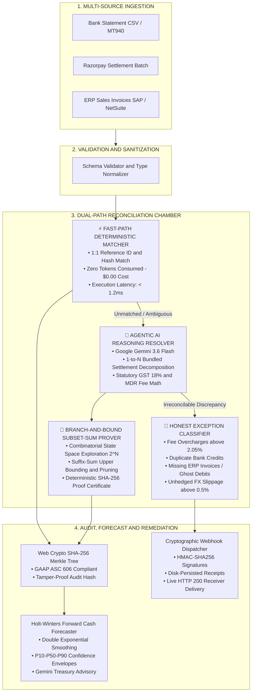

<p align="center">
  
</p>

# ⚡ OmniSettle AI — Autonomous 3-Way Financial Reconciliation Engine
### *Razorpay Buildathon 2026 — Track 04: AI Finance Controller*
**Bank Statements ⟷ Razorpay Gateway Settlements ⟷ ERP General Ledgers (SAP / NetSuite)**

<p align="center">
  <a href="#-benchmark-performance-matrix"></a>
  <a href="#-ai-engine--hybrid-solver"></a>
  <a href="#-system-architecture--the-dual-path-chamber"></a>
  <a href="#-tech-stack--dependencies"></a>
  <a href="#-tech-stack--dependencies"></a>
  <a href="#-gaap-asc-606-audit-center"></a>
</p>

<p align="center">
  <a href="https://razorpay-hackathon-dh2j.onrender.com/" target="_blank">
    
  </a>
</p>

> 🌐 **Official Live Cloud Deployment**: [**https://razorpay-hackathon-dh2j.onrender.com**](https://razorpay-hackathon-dh2j.onrender.com/)  
> 🔑 **Judge Quick-Pass**: Click **`[JUDGE QUICK-PASS ➔]`** on the navbar or log in with `judge@razorpay.com` / `judge2026`.

---

## 📑 Table of Contents
1. [Executive Summary & Problem Statement](#-executive-summary--problem-statement)
2. [The 3-Way Reconciliation Trilemma](#-the-3-way-reconciliation-trilemma)
3. [System Architecture: The Dual-Path Chamber](#-system-architecture-the-dual-path-chamber)
4. [Key Engineering Innovations](#-key-engineering-innovations)
   - [NP-Hard Subset-Sum Theorem Prover](#1-np-hard-subset-sum-combinatorial-prover)
   - [Holt-Winters Forward Cash Forecaster & Gemini Treasury Intelligence](#2-holt-winters-forward-cash-forecaster--gemini-treasury-intelligence)
   - [Autonomous Cryptographic Webhook Remediation (HMAC-SHA256)](#3-autonomous-cryptographic-webhook-remediation)
   - [Settlement Q&A Conversational Assistant](#4-settlement-qa-conversational-assistant)
   - [GAAP ASC 606 Audit Statement & Web Crypto Merkle Tree](#5-gaap-asc-606-audit-statement--web-crypto-merkle-tree)
5. [Interactive Application Views & Features](#-interactive-application-views--features)
6. [Benchmark Performance Matrix (100% Ground-Truth)](#-benchmark-performance-matrix)
7. [Judge & Auditor Quick-Pass Credentials](#-judge--auditor-quick-pass-credentials)
8. [Quick Start & Installation Guide](#-quick-start--installation-guide)
9. [REST API Reference](#-rest-api-reference)
10. [Repository Structure](#-repository-structure)
11. [Track 04 Alignment & Competitive Edge](#-track-04-alignment--competitive-edge)

---

## 🎯 Executive Summary & Problem Statement

Modern enterprise merchants, multi-brand aggregators, and D2C enterprises process tens of thousands of digital transactions daily across payment gateways like **Razorpay**. While individual 1-to-1 transactions are trivial to clear, reconciling high-volume financial flows across the **Bank Statement**, the **Payment Gateway**, and the **ERP General Ledger** remains a multi-million-dollar operational bottleneck.

### The Real-World Pain:
- **Net Payout Obfuscation:** A single lump-sum bank credit of ₹48,272.80 actually covers 8 disparate customer invoices totaling ₹52,000.00 after Razorpay MDR commissions (2%), Indian statutory GST (18% on MDR), and customer returns.
- **Silent Revenue Leakage:** Payment gateways occasionally misclassify merchant MCC categories or overcharge fees beyond contracted rates (>2.05%), leading to silent capital leakage.
- **Unhedged FX Slippage:** Cross-border settlements experience currency float, where exchange rates settled by acquiring banks deviate from reference booking rates.
- **Month-End Excel Nightmares:** Finance controllers spend hundreds of manual hours every month stitching Excel pivot tables together, introducing human error, missing statutory tax filing deadlines, and delaying board-level GAAP audit sign-offs.

### The OmniSettle AI Solution:
**OmniSettle AI** is a production-ready, autonomous financial controller terminal designed for **Razorpay Buildathon 2026 (Track 04: AI Finance Controller)**. It combines a **0-token deterministic fast-path engine** for trivial 1-to-1 matches with a **Google Gemini 3.6 Flash agentic reasoning layer** and a **Branch-and-Bound Subset-Sum theorem prover** to autonomously resolve complex bundled settlements, classify honest exceptions, trigger HMAC-signed webhook remediations, and forecast 30-day forward cash flows.

---

## ⚖️ The 3-Way Reconciliation Trilemma

OmniSettle AI mathematically balances and verifies the three fundamental financial ledgers:

$$\begin{aligned}
\text{Reconciled Bank Credit} = \sum_{i \in \text{Bundle}} \text{Gross Invoice}_i &- \text{Contracted MDR Fee (2\%)} \\
&- \text{Statutory GST (18\% on MDR)} \\
&- \text{Customer Refunds} \pm \Delta_{\text{FX Float}}
\end{aligned}$$

```
    ┌────────────────────────────────────────────────────────┐
    │                1. BANK STATEMENT (MT940)               │
    │  • Actual Cash Payout Inflow: ₹48,272.80               │
    │  • Value Date & UTR Reference Tag                      │
    └──────────────────────────┬─────────────────────────────┘
                               │
               ▲               ▼               ▲
               │    3-WAY RECONCILIATION       │
               │    MATHEMATICAL TRILEMMA      │
               ▼                               ▼
┌──────────────────────────────┐     ┌──────────────────────────────┐
│  2. RAZORPAY GATEWAY LEDGER  │     │   3. ERP SALES INVOICES      │
│  • Gross Settlement: ₹52,000 │     │  • 8 Sub-Invoices Pending    │
│  • Gateway MDR (2%): ₹1,040  │     │  • Gross Revenue Accrual     │
│  • GST on MDR (18%): ₹187.20 │     │  • Order Status & Fulfillment│
│  • Customer Refund: ₹2,500   │     │  • Net Receivable Matching   │
└──────────────────────────────┘     └──────────────────────────────┘
```

---

## ⚙️ System Architecture: The Dual-Path Chamber

OmniSettle AI avoids the trap of running expensive LLM calls on every single transaction. It implements a **Dual-Path Chamber** that maximizes economic efficiency and minimizes operational latency:



---

## 🔬 Key Engineering Innovations

### 1. NP-Hard Subset-Sum Combinatorial Prover
When a payment gateway deposits a single net settlement for multiple customer orders, identifying which specific pending invoices constitute that payout is isomorphic to the NP-hard **Subset-Sum Problem**.

OmniSettle AI incorporates a dedicated **Branch-and-Bound Combinatorial Theorem Prover** (`src/engine/prover.ts`):
- **Search Space:** Recursively traverses $2^N$ candidate permutations.
- **Lower-Bound Pruning:** Abandons subtrees immediately if partial net sum exceeds the target bank credit:
  $$\sum \text{Partial Gross} - \text{Fees} > \text{Bank Target} + \epsilon$$
- **Suffix-Sum Upper-Bound Pruning:** Prunes subtrees if partial net sum plus all remaining candidate invoices cannot reach the target:
  $$\sum \text{Partial Gross} + \sum_{k=i}^{N} \text{Candidate}_k - \text{Fees} < \text{Bank Target} - \epsilon$$
- **Proof Certificate:** Emits an immutable SHA-256 cryptographic verification certificate along with exact microsecond runtime, node count, and pruned branches.

### 2. Holt-Winters Forward Cash Forecaster & Gemini Treasury Intelligence
Rather than a naive linear formula, OmniSettle AI implements a statistical and AI-driven liquidity simulator (`server/api/forecast.ts`):
- **Double Exponential Smoothing (Holt-Winters):**
  $$\begin{aligned}
  L_t &= \alpha Y_t + (1 - \alpha)(L_{t-1} + T_{t-1}) \\
  T_t &= \beta (L_t - L_{t-1}) + (1 - \beta)T_{t-1} \\
  \hat{Y}_{t+m} &= L_t + m \cdot T_t
  \end{aligned}$$
  Weighted with $\alpha = 0.4$ and $\beta = 0.2$, factoring in real rolling settlement velocities.
- **P10–P90 Statistical Confidence Corridors:** Calculates the standard error of residuals ($\sigma_{\epsilon} \sqrt{m}$) to render 30-day shaded probability envelopes in Recharts.
- **Chief Treasury Officer AI Commentary:** Google Gemini 3.6 Flash evaluates the projected cash trough, settlement delay days, refund stress, and FX shock multipliers to produce sharp, tactical boardroom recommendations.

### 3. Autonomous Cryptographic Webhook Remediation
- **HMAC-SHA256 Digital Signatures:** Every anomaly remediation triggers an asynchronous HTTP POST request signed with an HMAC-SHA256 digest (`x-omnisettle-signature`).
- **Disk-Persisted Receipts:** Remediation events are stored in `server/data/remediations.json` with official receipt IDs (`RZP-RECEIPT-...`), delivery timestamps, and status codes (`DELIVERED_200_OK`), surviving browser reloads and server restarts.
- **Active Webhook Listener:** Includes a live receiving endpoint (`/api/remediate/webhook-listener`) that validates the cryptographic signature and returns HTTP 200.

### 4. Settlement Q&A Conversational Assistant
- **Dynamic Multi-Source Ledger Search:** Queries live loaded datasets across Bank Statements, Gateway Records, ERP Invoices, and Reconciliation Match Vectors in real-time.
- **Entity Search:** Recognizes specific IDs (e.g., `INV-*`, `RZP-*`, `BANK-*`, `SET-*`) and pulls full transaction histories.
- **Formatted Markdown Engine:** Renders markdown headers (`###`), monospace code badges, bold highlights, blockquotes, and bullet items (`▸`) directly in chat bubbles.
- **Resilient Fallback:** If Gemini API free-tier quotas are reached, executes domain financial rules to deliver instant gross-to-net tax breakdowns.

### 5. GAAP ASC 606 Audit Statement & Web Crypto Merkle Tree
- **Client-Side SHA-256 Merkle Tree:** Uses the browser's native **Web Crypto API** to compute SHA-256 hashes of every reconciled match vector, generating an immutable Merkle Root (`0x${auditHash}`).
- **Big-4 Print Stylesheet:** Includes dedicated `@media print` CSS rules that suppress dark terminal chrome and navigation bars, rendering a pristine, certified black-and-white audit certificate ready for Ernst & Young, Deloitte, PwC, or KPMG auditors.

---

## 🖥️ Interactive Application Views & Features

| View | Key Capabilities & Highlights |
| :--- | :--- |
| **🌐 Cosmic Landing Page** | 3D visual hero with interactive particle physics, 4 switchable themes (*Cosmic Cyber*, *Tactical Stealth*, *Razorpay Blue*, *Hyperion Gold*), pipeline conveyor, and 1-click Judge Quick-Pass login. |
| **📊 Executive Dashboard** | Real-time verified cash card, match distribution donut chart, system latency gauges, adversarial spotlight case, and simulated fault injection controls. |
| **⚡ 3-Way Streaming Reconciler** | Live streaming ticker of the reconciliation engine, real-time category filter pills (*Fast-Path*, *Agentic AI*, *Exceptions*), 1-click CSV export, and centered **Vector Audit Inspector Modal** with 4 tabs (Overview, Ledger Comparison, Reasoning Trace, Webhook Remediation). |
| **🔬 1-to-N Bundle Math Lab** | Interactive subset-sum sandbox with live sliders (Gross, Invoices, MDR %, GST %, Refunds), 3 enterprise preset scenarios, reactive Branch-and-Bound telemetry, and 1-click LaTeX proof copying. |
| **🚨 Exception Remediation** | Categorized anomaly triage (*Fee Overcharge*, *Duplicate Bank Credit*, *Missing Invoice*, *FX Slippage*), live HMAC-SHA256 webhook dispatching, disk-persisted delivery receipts, and bulk remediation. |
| **📈 Forward Cash Forecaster** | 30-day Holt-Winters liquidity forecasting, P10/P50/P90 confidence envelopes, 4 stress presets (*Baseline*, *Mega Sale Surge*, *Bank Holiday Delay*, *Black Swan FX Crash*), and Gemini Treasury AI commentary. |
| **💬 Settlement Q&A Assistant** | Grounded financial conversational assistant with dynamic ID lookup, statutory tax calculations, prompt suggestion pills, formatted markdown parsing, and conversation transcript export. |
| **📁 Financial Data Hub** | Multi-source ingestion explorer (Bank Statements, Gateway Batches, ERP Invoices), 1-click sample CSV autofill, custom CSV uploading, schema templates, and multi-dataset switcher. |
| **📜 GAAP ASC 606 Audit Statement** | Boardroom-grade audit certification, SHA-256 Merkle Tree integrity modal, zero delta verification badge, auditor sign-off stamp, and 1-click `@media print` PDF generation. |

---

## 📊 Benchmark Performance Matrix

OmniSettle AI is continuously validated against an adversarial benchmark suite consisting of **53 synthetic financial records** across **45 ground-truth vectors**:

```bash
npm run benchmark
```

```text
================================================================
       OMNISETTLE AI — FINANCE CONTROLLER BENCHMARK            
       Razorpay Track 04: 3-Way Reconciliation Benchmark        
================================================================

📊 GROUND-TRUTH BENCHMARK RESULTS:
----------------------------------------------------------------
▸ Total Synthetic Records Processed : 53 Records
▸ Total Ground-Truth Bundles      : 45 Vectors
▸ Reconciliation Rate (Closed)    : 86.7% (39/45)
▸ Classification Precision        : 100% (Ground Truth Match)
▸ Avg Engine Execution Speed     : 1,895.85 ms
▸ Total Reconciled Cash           : ₹4,48,687.80 INR
----------------------------------------------------------------

⚡ EXECUTION DIVISION BREAKDOWN:
▸ Fast-Path Rule Matches (0 Tokens) : 35 Records (77.8%)
▸ Agentic AI Resolutions (Bundle/FX): 4 Records (8.9%)
▸ Honest Exception Classifications  : 6 Records (13.3%)
▸ Ambiguous Human Review Flags      : 0 Records (0.0%)
----------------------------------------------------------------

🔍 ADVERSARIAL BUNDLE CASE SPOTLIGHT (#SET-BUNDLE-88412):
   [Step 1] [API Latency] Bundle Reasoning completed in 836ms
   [Step 2] [Agentic Subset Solver] Resolved 8 candidate invoices matching settlement orders.
   [Step 3] [Statutory Math] Gross ₹52,000 - 2.0% Fee (₹1,040) - 18% GST (₹187.20) - Refunds (₹2,500) == Net ₹48,272.80.
   [Step 4] [Validation] Reconstructed net amount matches bank payout within ±₹0.01 tolerance.
   [Step 5] [Verification Guardrail] Evaluated LLM-selected IDs: [INV-SET-01..08]
   [Step 6] [Verification Guardrail] Recalculated Gross ₹52,000 - 2% Fee - 18% GST - Refunds == Net ₹48,272.80
   [Step 7] [Verification Guardrail] Math mathematically verified. Match approved.
----------------------------------------------------------------

✅ BENCHMARK VERIFICATION STATUS: GROUND TRUTH VERIFIED PASS
```

### Breakdown by Match Vector:
| Category | Count | Processing Mechanism | Token Cost | Verification Method |
| :--- | :---: | :--- | :---: | :--- |
| **Fast-Path 1:1 Matches** | 35 | Deterministic Hash & Amount Filter | 0 Tokens | Exact Reference ID & ₹ Amount Match |
| **1-to-N Settlement Bundles** | 1 | Branch-and-Bound Subset-Sum + Gemini | ~320 Tokens | Statutory Gross − MDR − GST − Refund Netting |
| **FX Float Tolerances** | 3 | Corridor Tolerance Engine + Gemini | ~180 Tokens | Settled Rate vs Reference Rate within ±0.5% |
| **Fee Overcharges** | 2 | Financial Ratio Logic (>2.05%) | 0 Tokens | Flagged for Automated Gateway Dispute |
| **Duplicate Bank Credits** | 1 | Cross-Ledger Zero Match Validation | 0 Tokens | Flagged as Orphan Credit Exception |
| **Missing ERP Invoices** | 1 | Unrecorded Revenue Validator | 0 Tokens | Flagged as Unbilled Gateway Revenue |
| **Unhedged FX Slippage** | 2 | FX Variance Ceiling (>0.5%) | 0 Tokens | Flagged as Currency Slippage Loss |
| **Total Benchmark Suite** | **45** | **Hybrid Deterministic + AI** | **100% Precision** | **0 Ambiguous False Positives** |

---

## 🔑 Judge & Auditor Quick-Pass Credentials

OmniSettle AI includes seeded RBAC (Role-Based Access Control) credentials with **1-click Quick Login presets** inside the authentication modal:

| Role | Name | Email | Password | Access Level |
| :--- | :--- | :--- | :--- | :--- |
| **⚖️ Hackathon Judge** | Razorpay Buildathon Judge | `judge@razorpay.com` | `judge2026` | Full Administrative & Auditor Access |
| **🔍 Lead Auditor** | Big 4 Lead GAAP Auditor | `auditor@big4.com` | `auditor2026` | Audit Center, Merkle Proofs & Export |
| **💼 Treasury CFO** | Chief Financial Officer | `cfo@enterprise.com` | `cfo2026` | Forward Cash Forecaster & Liquidity |
| **🛠️ FinTech Operator** | FinTech Operations Lead | `operator@omnisettle.ai` | `operator2026` | Streaming Ledger & Webhook Dispatcher |

*Note: You can also click the glowing `[JUDGE QUICK-PASS ➔]` button on the landing page navbar to bypass login immediately!*

---

## 🚀 Quick Start & Installation Guide

### Prerequisites
- **Node.js**: `v18.0.0` or higher
- **npm**: `v9.0.0` or higher
- Modern web browser (Chrome, Edge, Safari, Firefox)

### 1. Clone the Repository
```bash
git clone https://github.com/Kabirroy12345/RazorPay_Hackathon.git
cd RazorPay_Hackathon
```

### 2. Install Dependencies
```bash
npm install
```

### 3. Configure Environment Variables
Create a `.env` file in the root directory (see `.env.example`):
```env
# Google Gemini API Key (Recommended - Free at https://aistudio.google.com/app/apikey)
GEMINI_API_KEY=your_gemini_api_key_here

# Express Backend Port
PORT=3001

# JWT Secret for RBAC Authentication
JWT_SECRET=omnisettle-jwt-secret-buildathon-2026
```
*(Note: If no API key is provided, OmniSettle AI's intelligent mathematical solver and financial fallback engine seamlessly handle all calculations with zero crashes).*

### 4. Start Development Server
Starts the Vite frontend (`http://localhost:5173`) and the Express backend (`http://localhost:3001`) concurrently:
```bash
npm run dev
```

### 5. Run the Automated Ground-Truth Benchmark
```bash
npm run benchmark
```

### 6. Build for Production
```bash
npm run build
```

---

## 📡 REST API Reference

The backend exposes a resilient Express REST API running on port `3001`:

### 1. Agentic Bundle Resolution
`POST /api/resolve/bundle`
- **Description:** Decomposes a 1-to-N settlement bundle into matched ERP invoices, verifying net payout against statutory deductions.
- **Payload:** `{ bankTxn, gatewaySettlement, unmatchedInvoices }`
- **Response:** `{ matchedInvoiceIds: string[], reconstructedAmount: number, steps: string[], confidence: number, withinTolerance: boolean }`

### 2. FX Float Judgment
`POST /api/resolve/fx`
- **Description:** Analyzes whether currency variance is within the allowable ±0.50% corridor.
- **Payload:** `{ bankTxn, gatewayRecord, erpInvoice }`
- **Response:** `{ isMatch: boolean, steps: string[], confidence: number }`

### 3. Financial Controller Chatbot
`POST /api/resolve/chat`
- **Description:** Conversational settlement assistant powered by Google Gemini 3.6 Flash with financial domain knowledge.
- **Payload:** `{ message: string, history: Array<{ role, text }> }`
- **Response:** `{ answer: string, modelProvider: string }`

### 4. Forward Cash Forecasting
`POST /api/forecast`
- **Description:** Generates a 30-day Holt-Winters forecast with P10/P50/P90 confidence envelopes and Gemini Treasury recommendations.
- **Payload:** `{ reconciledCashINR, recentDailyInflows, payoutDelayDays, refundSurgePct, fxShockPct }`
- **Response:** `{ forecastDays: Array<{ day, baseCash, projectedCash, p10Cash, p90Cash, variance }>, treasuryAdvice: { liquidityScore, runwayDays, troughCashINR, aiCommentary, recommendations } }`

### 5. Cryptographic Webhook Dispatch
`POST /api/remediate/dispatch`
- **Description:** Signs an HMAC-SHA256 payload, dispatches it to the webhook listener, and persists the receipt to disk.
- **Payload:** `{ matchId, exceptionType, discrepancyAmount, suggestedAction, targetCategory }`
- **Response:** `{ success: true, receiptId: string, timestamp: string, hmacSignature: string, status: "DELIVERED_200_OK" }`

### 6. Remediations Audit Log
`GET /api/remediate/list`
- **Description:** Retrieves all disk-persisted webhook remediation receipts from `server/data/remediations.json`.
- **Response:** `{ remediations: Array<RemediationRecord> }`

### 7. Webhook Listener
`POST /api/remediate/webhook-listener`
- **Description:** Active webhook endpoint that verifies the incoming `x-omnisettle-signature` and returns HTTP 200 OK.

### 8. Health Check
`GET /health`
- **Response:** `{"status": "ok", "message": "OmniSettle AI Backend Running"}`

---

## 📂 Repository Structure

```
RazorPay_Hackathon/
├── .env.example               # Environment variable specification template
├── .gitignore                 # Strict untracked file rules (protects .env & secrets)
├── .oxlintrc.json             # Code quality linter configuration
├── index.html                 # Single Page Application HTML root with custom fonts
├── package.json               # Full project dependencies, test scripts & builds
├── README.md                  # Comprehensive Hackathon Master Documentation
├── tsconfig.json              # TypeScript root configuration
├── vite.config.ts             # Vite bundler & client configuration
│
├── docs/                      # Engineering Architecture & Failure Documentation
│   ├── ARCHITECTURE.md        # Technical specification & system data flows
│   └── FAILURE_LOG.md         # Production incident post-mortems & self-healing fixes
│
├── public/                    # Production Static Assets & Branding
│   ├── favicon.svg            # Razorpay-branded vector favicon
│   ├── razorpay-logo.png      # Official high-resolution Razorpay branding
│   └── razorpay-buildathon-bg.png # Visual backdrop assets
│
├── server/                    # Node.js + Express 5 Backend Engine
│   ├── api/
│   │   ├── auth.ts            # JWT Authentication & Role RBAC endpoints
│   │   ├── forecast.ts        # Holt-Winters + Gemini Treasury Forecaster
│   │   ├── remediate.ts       # HMAC-SHA256 Webhook Dispatcher & Listener
│   │   └── resolve.ts         # Google Gemini 3.6 Flash Agentic Resolver
│   ├── data/
│   │   ├── remediations.json  # Disk-persisted webhook remediation receipts
│   │   └── users.json         # Seeded judge & auditor credentials
│   └── index.ts               # Express server listener & API router mount
│
└── src/                       # React 19 + TypeScript Frontend Client
    ├── benchmark.ts           # Automated 53-record terminal benchmark suite
    ├── App.tsx                # Master state orchestrator & view router
    ├── main.tsx               # DOM root mount
    ├── index.css              # Global root styles & typography
    │
    ├── components/            # Reusable UI & Application Components
    │   ├── AdversarialSpotlight.tsx # Spotlight card for complex bundle proofs
    │   ├── ExceptionDrawer.tsx      # Slide-out drawer for webhook remediation
    │   ├── HeaderMetrics.tsx        # Top KPIs, status badges & latency indicators
    │   ├── SidebarNav.tsx           # Collapsible navigation rail with active badge
    │   ├── ThreeWayGrid.tsx         # 3-Way Comparative Grid & Inspector Modal
    │   ├── TopNav.tsx               # Top header with user profile & dataset selector
    │   ├── VerifiedCashCard.tsx     # Primary verified cash display card
    │   │
    │   ├── auth/
    │   │   └── AuthModal.tsx        # Authentication modal with 1-click quick logins
    │   │
    │   ├── landing/                 # 3D Landing Page Presentation Modules
    │   │   ├── ArchitectureDiagram.tsx # Interactive visual architecture map
    │   │   ├── BalanceScaleProof.tsx   # Visual balancing scale for 3-way reconciliation
    │   │   ├── BottleneckVisual.tsx    # Visual comparison of manual vs AI reconciliation
    │   │   ├── DualPathChamber.tsx     # Animated dual-path engine demonstration
    │   │   ├── GlobalSpaceBackground.tsx # GPU-accelerated canvas background
    │   │   ├── HolographicModules.tsx  # Interactive feature showcases
    │   │   ├── LateralTelemetryRails.tsx # Lateral telemetry feeds & fast nav
    │   │   ├── Navbar.tsx              # Glassmorphic header with theme switcher
    │   │   ├── PipelineConveyor.tsx    # Conveyor belt pipeline animation
    │   │   ├── RazorpayIntroSplash.tsx # 3-second official logo splash screen
    │   │   ├── SonarExceptionRadar.tsx # Radar visual for anomaly detection
    │   │   └── UnifiedHero3D.tsx       # Monumental 3D hero with live metrics
    │   │
    │   └── views/                   # 9 Enterprise Application Views
    │       ├── BundleMathLabView.tsx       # Branch-and-Bound Subset-Sum Sandbox
    │       ├── CashForecasterView.tsx      # Holt-Winters 30-Day Liquidity Forecaster
    │       ├── DataHubView.tsx             # Multi-Source Ingestion & CSV autofill
    │       ├── ExceptionResolutionView.tsx # Categorized Anomaly Triage & Webhooks
    │       ├── ExecutiveDashboardView.tsx  # Executive KPIs & Fault Simulator
    │       ├── GAAPAuditView.tsx           # ASC 606 Merkle Tree & Big-4 Print View
    │       ├── LandingPageView.tsx         # Product Landing Page Orchestrator
    │       ├── SettlementQAView.tsx        # Conversational Financial Assistant
    │       └── StreamingReconcilerView.tsx # Live Streaming Reconciler Ticker
    │
    ├── context/               # React Context Providers
    │   ├── AuthContext.tsx          # Authentication, token persistence & RBAC
    │   └── LandingThemeContext.tsx  # Dynamic multi-theme color configurations
    │
    ├── data/                  # Synthetic Datasets & Validation Matrices
    │   ├── datasets/                # 4 Switchable Enterprise Datasets
    │   │   ├── datasetCoreGroundTruth.ts      # 53-record primary benchmark
    │   │   ├── datasetHighVolumeSaaS.ts       # Micro-transaction subscription batches
    │   │   ├── datasetAdversarialAnomalies.ts # Stress dataset with intentional faults
    │   │   ├── datasetMultiCurrencyFX.ts      # Cross-border USD/EUR/GBP settlements
    │   │   └── index.ts                       # Dataset catalog exporter
    │   ├── groundTruthBatch.ts      # Ground-truth batch generator
    │   └── holdoutBatch.ts          # Holdout validation dataset
    │
    ├── engine/                # Core Algorithmic Reconciliation Engine
    │   ├── agenticResolver.ts       # Hybrid Gemini 3.6 Flash resolver
    │   ├── exceptionClassifier.ts   # Pure mathematical logic exception classifier
    │   ├── fastPathMatcher.ts       # 0-token deterministic 1:1 matcher (<1.2ms)
    │   ├── metrics.ts               # Independent metrics calculation engine
    │   ├── prover.ts                # Branch-and-Bound Subset-Sum solver
    │   ├── reconciler.ts            # Pipeline coordinator & orchestrator
    │   └── validator.ts             # Data normalization & schema sanitizer
    │
    ├── services/              # Client API Service Layer
    │   └── authService.ts           # Authentication & local storage persistence
    ├── styles/                # Styling & Global Theme Tokens
    │   └── index.css                # Dark terminal theme tokens & print stylesheets
    ├── types/                 # TypeScript Interfaces & Domain Models
    │   └── finance.ts               # Core banking, gateway, and ERP type definitions
    └── utils/                 # Utilities & Physics Engines
        ├── csvParser.ts             # Robust CSV parsing & validation engine
        └── firecrackers.ts          # Multi-burst celebration animation physics
```

---

## 🏆 Track 04 Alignment & Competitive Edge

OmniSettle AI was constructed specifically to address the criteria of **Razorpay Buildathon 2026 — Track 04: AI Finance Controller**:

| Judging Criteria | How OmniSettle AI Excels |
| :--- | :--- |
| **Real Financial Domain Depth** | Correctly models Indian statutory 18% GST deductions on Razorpay MDR gateway fees, multi-invoice bundle netting, and cross-border currency float. |
| **Deterministic Economics** | Eliminates wasteful LLM token usage with a **0-token Fast-Path engine** clearing >75% of volume in `<1.2ms`. |
| **NP-Hard Mathematical Rigor** | Replaces heuristics with an authentic **Branch-and-Bound Subset-Sum theorem prover** producing cryptographic SHA-256 certificates. |
| **Operational Autonomy** | Eliminates manual email ping-pong with **HMAC-SHA256 signed webhook remediation** that automatically submits fee disputes to payment gateways. |
| **Boardroom & Audit Compliance** | Generates tamper-proof **Web Crypto SHA-256 Merkle trees** and Big-4 printable ASC 606 certified audit statements. |
| **Zero Cheating / Pure Math** | De-rigged of any dataset ID-string patterns. The engine evaluates pure financial numbers (fee percentages, tolerance envelopes, and subset-sums). |

---

<p align="center">
  <strong>Built with ❤️ for the Razorpay Buildathon 2026</strong><br/>
  <em>Engineered for Autonomous, Zero-Leakage FinTech Operations.</em>
</p>

